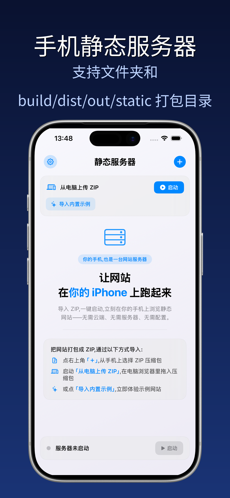
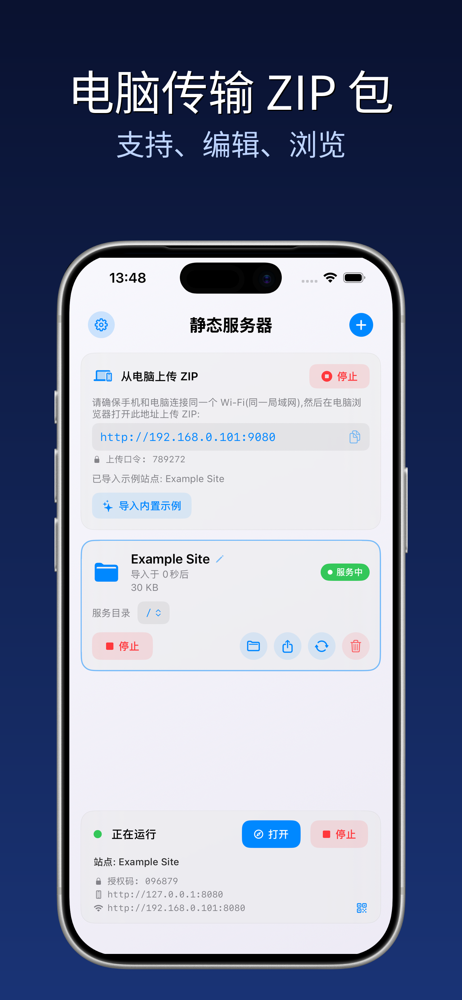
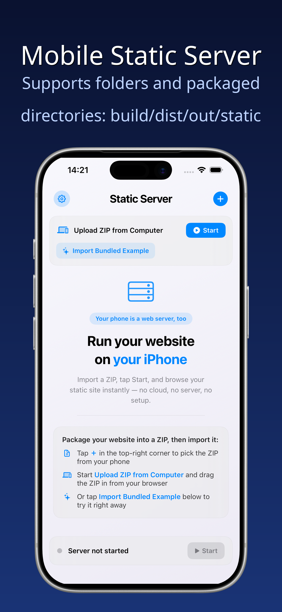
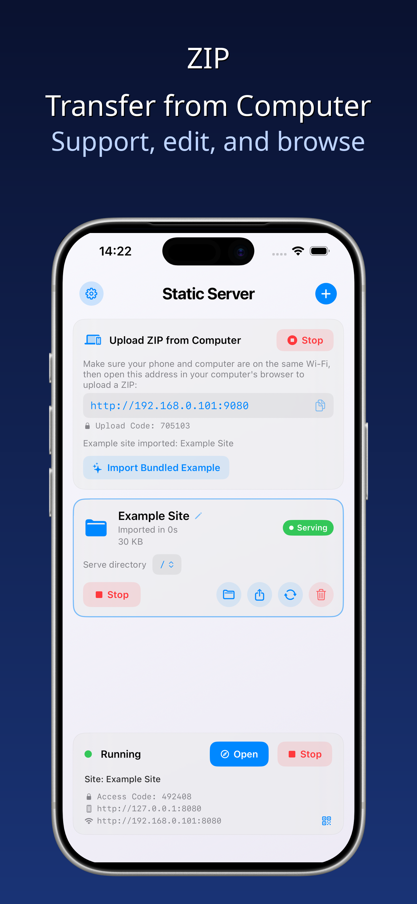
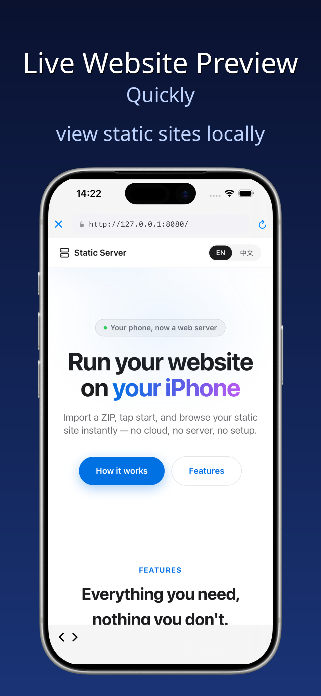

# 静态服务器

**随身 Web 运行环境，静态网站可直接在本机运行**

**[📱 立即下载 / Download Now →](https://apps.apple.com/cn/app/%E9%9D%99%E6%80%81%E6%9C%8D%E5%8A%A1%E5%99%A8/id6803017610)**

---

# Static Server

**A portable Web runtime. Run static websites directly on your device**

---

## 🇨🇳 中文介绍

### ✨ 功能亮点

🚀 **一键启动本地服务**  
导入压缩包，一键启动本地 HTTP 服务，即可在移动设备上直接加载完整的编译产物或现成工具。

🔧 **完整的 Web 运行能力**  
标准 HTTP 运行环境，完整支持页面路由、WebAssembly、IndexedDB 本地存储与单页应用（SPA）。

📱 **主流框架兼容**  
支持 Vue、React、Vite、Next 等主流框架的 dist、build、out、static 编译输出目录。

🐍 **WASM 应用支持**  
兼容绝大多数 WASM 类应用，例如 JupyterLite，在手机上直接使用浏览器版 Python 运行环境。

🔒 **数据安全与隐私**  
全部数据保存在本机，离线可用，文件与代码从不离开你的设备。

🌐 **局域网便捷传输**  
局域网内拖拽上传压缩包，无需数据线，不依赖任何云端服务器。

### 👥 适用人群

🎯 **面向开发者**  
校验编译产物在移动端的真实运行状态，发现仅手机端才会暴露的兼容性问题。

📚 **面向编程初学者**  
无需搭建复杂的开发环境，导入离线编程环境，随时随地开展学习实践。

👤 **面向个人用户**  
把开源白板、思维导图、绘图笔记等现成 Web 工具装进手机，用于学习、备课、做计划、整理思路，不必会写代码，也能享受移动端随手可用的便利。

👥 **面向团队**  
同一局域网内，其他设备均可访问手机上正在运行的 Web 工具。

### 🎬 使用场景

- 🚄 高铁上给同事演示产品原型 — 不必再随身携带电脑
- 📚 课堂上跑一套离线编程环境 — 手机在手，Web 工具随时可跑
- 🎨 用白板梳理一节课的思路 — 各种交互工具都能在手机本地运行
- 💡 快速验证前端项目 — 导入 dist 文件夹即可预览

### 📱 iPhone 截图

<table>
  <tr>
    <td></td>
    <td></td>
    <td></td>
  </tr>
</table>

---

## 🇺🇸 English

### ✨ Features

🚀 **One-tap Local Server Launch**  
Import a compressed package and start a local HTTP service with one tap, and you can load complete build output or ready-made tools directly on your mobile device.

🔧 **Full Web Runtime Capabilities**  
A standard HTTP runtime that fully supports page routing, WebAssembly, IndexedDB local storage, and single-page applications (SPA).

📱 **Mainstream Framework Compatibility**  
Supports the dist, build, out, and static build output directories of mainstream frameworks such as Vue, React, Vite, and Next.

🐍 **WASM Application Support**  
Compatible with the vast majority of WASM applications, such as JupyterLite, letting you use a browser-based Python runtime directly on your phone.

🔒 **Data Security & Privacy**  
All data is stored on the device, usable offline, and your files and code never leave your device.

🌐 **LAN File Transfer**  
Drag-and-drop upload of packages over the local network, no cable needed, no reliance on any cloud server.

### 👥 Who It's For

🎯 **For Developers**  
Verify how build output actually runs on mobile and catch compatibility issues that only surface on phones.

📚 **For Programming Beginners**  
No need to set up a complex development environment — import an offline coding environment and start learning anytime, anywhere.

👤 **For Personal Users**  
Put ready-made Web tools such as open-source whiteboards, mind maps, and drawing notes into your phone for studying, lesson prep, planning, and organizing thoughts — no coding required to enjoy the convenience of having them ready at hand on mobile.

👥 **For Teams**  
On the same local network, other devices can access the Web tools running on your phone.

### 🎬 Use Cases

- 🚄 Demo on the train — No need to carry a laptop
- 📚 Run offline coding environment in class — Your Web tools are ready to run anytime
- 🎨 Use whiteboard to organize lesson flow — All kinds of interactive tools can run locally on your phone
- 💡 Quick frontend preview — Import dist folder and preview instantly

### 📱 iPhone Screenshots

<table>
  <tr>
    <td></td>
    <td></td>
    <td></td>
  </tr>
</table>

---

## 📥 下载 / Download

**📱 点击下载 / Download Now →** https://apps.apple.com/cn/app/%E9%9D%99%E6%80%81%E6%9C%8D%E5%8A%A1%E5%99%A8/id6803017610

**支持系统 / Supported Systems:** iOS 17.0+ | iPadOS 17.0+ | macOS 14.0+ (Apple Silicon)

**价格 / Price:** 免费 / Free (含应用内购买 / In-App Purchase)

---

## 📄 许可证 / License

MIT License

---

  Made with ❤️ by <a href="https://github.com/themass1226">Static Server Team</a>

